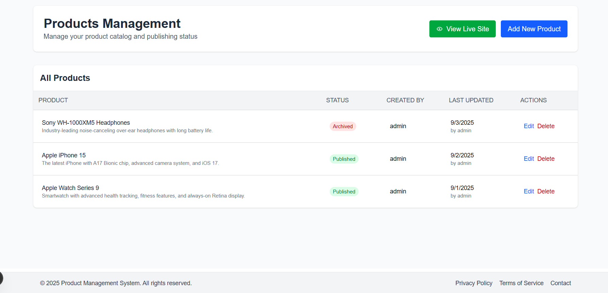

# Products Management Module

This project implements a **Products Management Module** using **Next.js**, **Express.js**, and **MySQL**. The system supports full product lifecycle management, including **adding**, **editing**, **deleting (soft delete)**, and **publishing** products.

---

## Features

- **Add New Product**  
  Users can create a new product with the following fields:
  - Name
  - Description
  - Status (`Draft`, `Published`, `Archived`)
  
- **Edit Product**  
  Users can update existing product details including name, description, or status.

- **Delete Product (Soft Delete)**  
  Products are never physically deleted. Instead, they are marked as `is_deleted = TRUE` to maintain an audit trail.

- **Audit Trail**  
  - `created_by` and `updated_by` fields track the user responsible for actions.  
  - `created_at` and `updated_at` timestamps are automatically maintained.  
  - Data integrity and traceability are ensured for all product operations.

- **Publish Live Content**  
  Products with status `Published` are immediately visible on the live website.

---

## Database Design

**Table: `Products`**

```sql
CREATE TABLE Products (
    product_id      INT AUTO_INCREMENT PRIMARY KEY,
    product_name    VARCHAR(100) NOT NULL,
    product_desc    TEXT,
    status          ENUM('Draft', 'Published', 'Archived') DEFAULT 'Draft',

    created_by      VARCHAR(50) NOT NULL,
    created_at      TIMESTAMP DEFAULT CURRENT_TIMESTAMP,
    updated_by      VARCHAR(50),
    updated_at      TIMESTAMP DEFAULT CURRENT_TIMESTAMP ON UPDATE CURRENT_TIMESTAMP,
    is_deleted      BOOLEAN DEFAULT FALSE
);
```

### Example Queries
1. Insert a New Product
```sql
INSERT INTO Products (product_name, product_desc, created_by, status)
VALUES ('Product A', 'Description for Product A', 'admin', 'Draft');
```

2. Update Product Details
```sql
UPDATE Products
SET product_desc = 'Updated description', updated_by = 'editor', status = 'Published'
WHERE product_id = 1;
```

3. Soft Delete a Product
```sql
UPDATE Products
SET is_deleted = TRUE, updated_by = 'admin'
WHERE product_id = 2;
```

4. Fetch Products for Live Display
```sql
SELECT product_id, product_name, product_desc
FROM Products
WHERE status = 'Published' AND is_deleted = FALSE;
```

---

## Tech Stack
1. Frontend: Next.js
2. Backend: Express.js
3. Database: MySQL

---

## How to Run the Project
1. Clone the Repository
```bash
git clone https://github.com/Mansi-prasad/Products-Management-Module
cd Products-Management-Module
```

2. Install Dependencies
```bash
# For Backend
cd backend
npm install

# For Frontend
cd ../frontend
npm install
```

3. Configure MySQL Database
 -  Create a database and run the `Products` table script above.
 - Update the `.env` file with your database credentials.

4. Start the Backend Server
```bash
cd backend
npm run server
```

5. Start the Frontend Server
```bash
cd frontend
npm run dev
```
6. Access the Products Management Module Interface
 - Open `http://localhost:3000` in your browser.
 - Add, edit, delete, and publish products.

---

## 📸 Screenshots

**Home Page:** 



**Products Page:**


**Admin Dashboard:**


**Product Edit Page:**


**Add New Product Page:**


---

## Live Link

